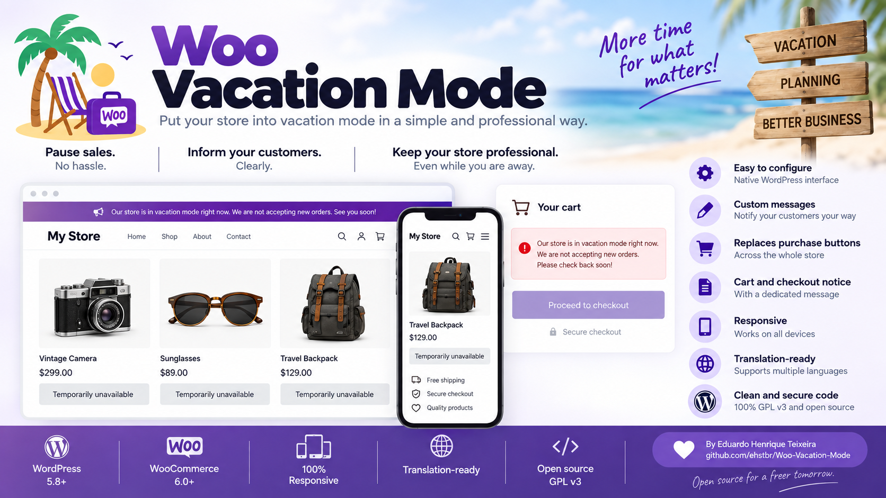

# Woo Vacation Mode Basic

[Português (Brasil)](README-pt_BR.md)

A lightweight, open-source vacation mode plugin for WooCommerce. Pause new purchases without taking your store offline, while keeping customers clearly informed.

## Features

- Enable or disable vacation mode from WordPress admin.
- Full-width notice bar at the top or bottom of the site.
- WYSIWYG editor for the main notice, with alignment and font-size controls.
- Custom background, text and close-button colors.
- Optional close button with configurable redisplay time.
- Show the notice site-wide or only on WooCommerce pages.
- Hide standard purchase buttons while vacation mode is active.
- Custom replacement message in the purchase-button area.
- Separate cart and checkout notice.
- Limited safe HTML support in the cart/checkout and replacement messages.
- Purchase blocking at WooCommerce validation level.
- Translation-ready with a `.pot` template.
- Brazilian Portuguese translation included.
- Native WordPress admin UI; no external UI framework.

## Installation

1. Download the release ZIP.
2. In WordPress, open **Plugins > Add New > Upload Plugin**.
3. Upload the ZIP and activate **Woo Vacation Mode Basic**.
4. Open **WooCommerce > Vacation mode**.
5. Configure the notice, colors, messages and purchase behavior.

## Customer-facing messages

The plugin uses three independent messages:

1. **Notice bar message** — edited with the WordPress WYSIWYG editor.
2. **Cart and checkout message** — a dedicated WooCommerce notice with limited safe HTML.
3. **Replacement text for purchase buttons** — displayed where standard purchase controls normally appear, also with limited safe HTML.

Supported simple HTML includes tags such as `<b>`, `<strong>`, `<i>`, `<em>`, `<u>`, ` `, `
` and `
`.

## Translations

English is the source language. Brazilian Portuguese (`pt_BR`) is included. Translation files are encoded in UTF-8:

- `languages/woo-vacation-mode-basic.pot`
- `languages/woo-vacation-mode-basic-pt_BR.po`
- `languages/woo-vacation-mode-basic-pt_BR.mo`

## Compatibility

The plugin uses standard WooCommerce hooks and CSS fallbacks. Themes or page builders that heavily replace WooCommerce purchase markup may require specific compatibility adjustments.

## Author

Developed by **Eduardo Henrique Teixeira**, an e-commerce and marketplace professional and open-source enthusiast.

- GitHub: [https://github.com/ehstbr/Woo-Vacation-Mode](https://github.com/ehstbr/Woo-Vacation-Mode)
- Profile: [https://github.com/ehstbr](https://github.com/ehstbr)

Issues, pull requests and compatibility improvements are welcome.

## License

Licensed under the **GNU General Public License v3.0 or later (GPL-3.0-or-later)**. See [LICENSE](LICENSE).
